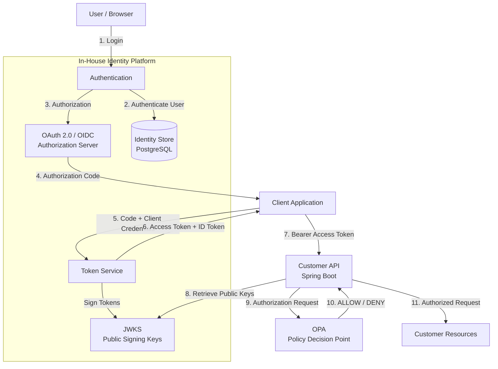

```mermaid
flowchart TB

    User["User / Browser"]
    Client["Client Application"]

    subgraph Identity["In-House Identity Platform"]
        Auth["Authentication"]
        OAuth["OAuth 2.0 / OIDC<br/>Authorization Server"]
        Token["Token Service"]
        JWKS["JWKS<br/>Public Signing Keys"]
        IdentityDB[("Identity Store<br/>PostgreSQL")]
    end

    API["Customer API<br/>Spring Boot"]

    OPA["OPA<br/>Policy Decision Point"]

    Resource["Customer Resources"]

    User -->|"1. Login"| Auth
    Auth -->|"2. Authenticate User"| IdentityDB

    Auth -->|"3. Authorization"| OAuth

    OAuth -->|"4. Authorization Code"| Client

    Client -->|"5. Code + Client Credentials"| Token

    Token -->|"6. Access Token + ID Token"| Client

    Token -->|"Sign Tokens"| JWKS

    Client -->|"7. Bearer Access Token"| API

    API -->|"8. Retrieve Public Keys"| JWKS

    API -->|"9. Authorization Request"| OPA

    OPA -->|"10. ALLOW / DENY"| API

    API -->|"11. Authorized Request"| Resource
```
